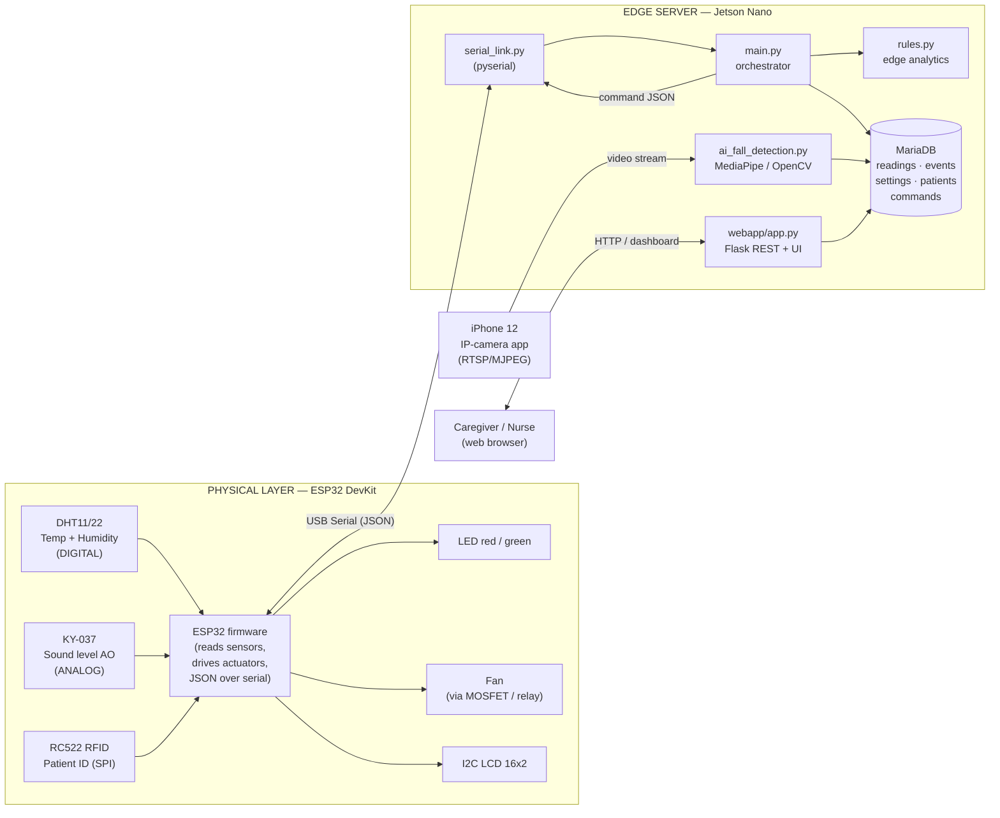
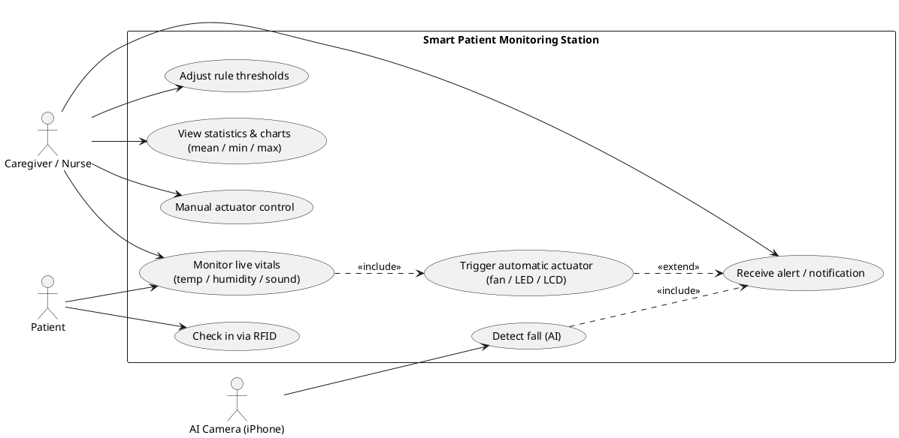
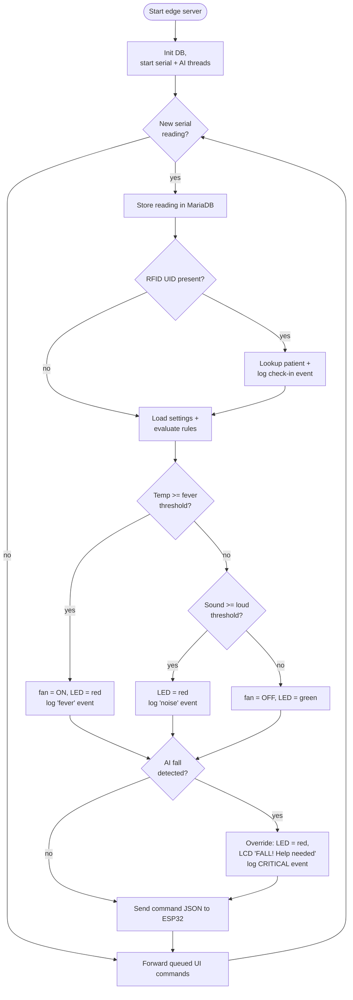
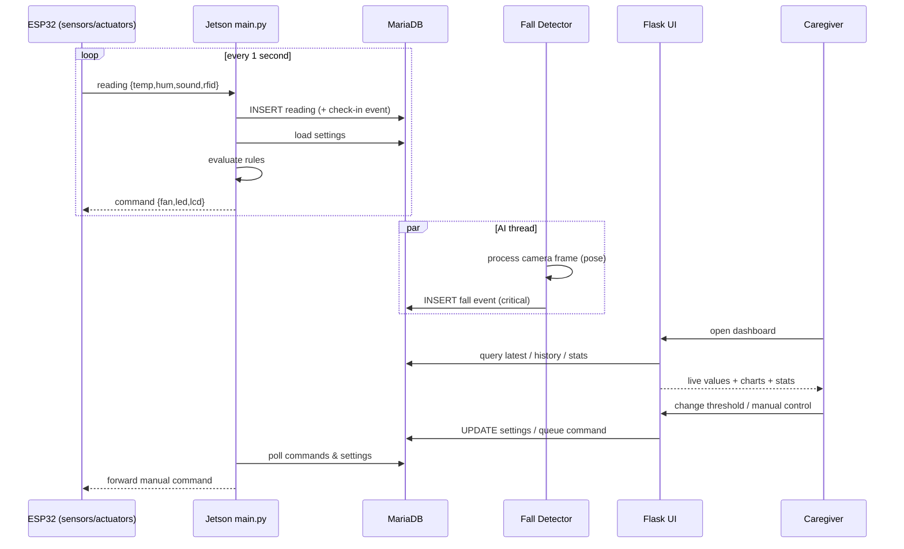
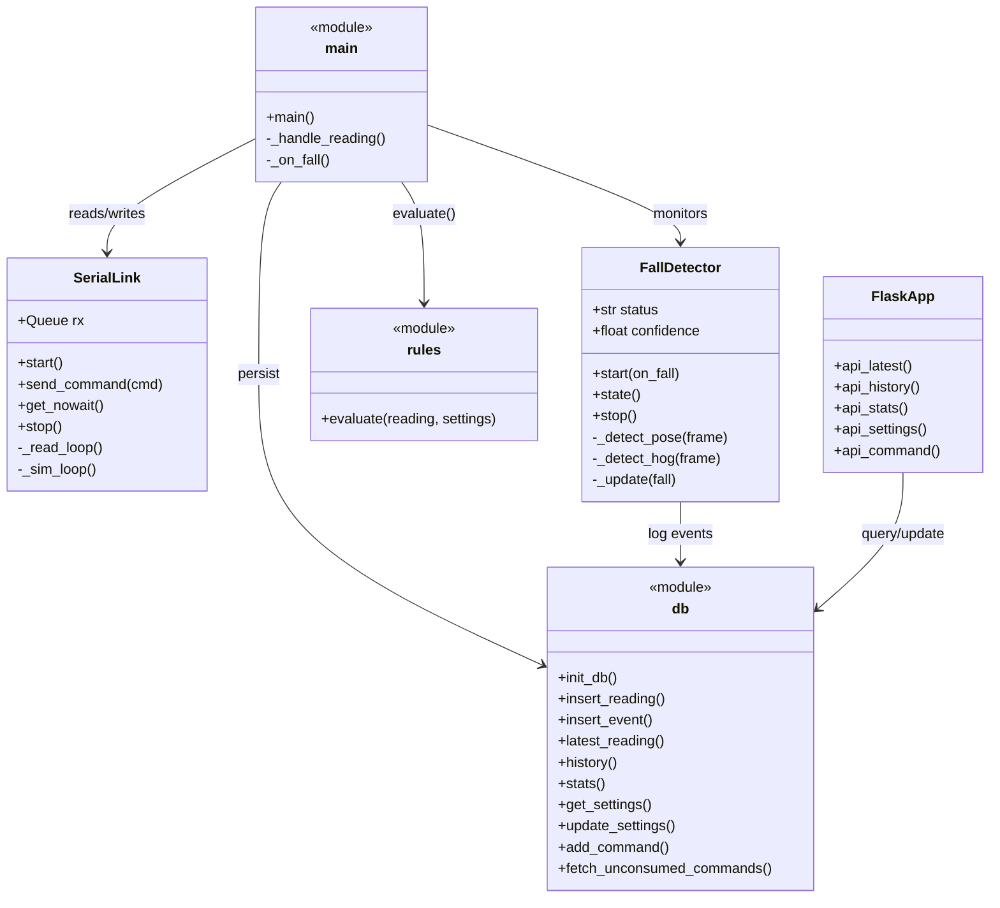
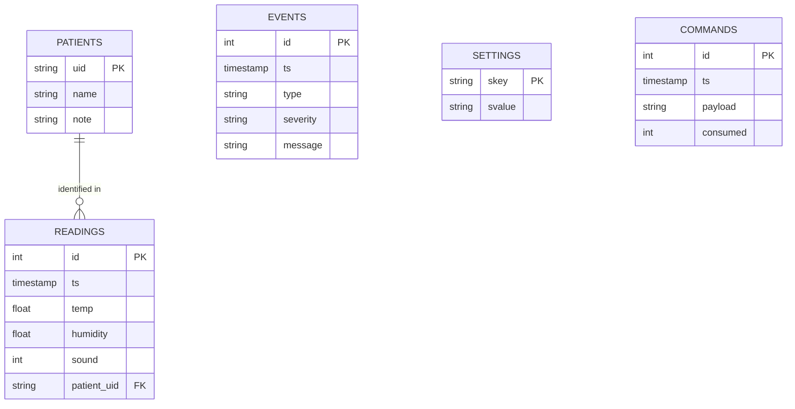

# Conceptual Design — Block Diagram & UML

Diagrams for the project report (Smart Patient/Elderly Monitoring Station).
Each block matches the actual code in this repo.

## How to render these into images for the report
- **Mermaid blocks** → open <https://mermaid.live>, paste the code, *Actions → PNG/SVG*.
  In VS Code you can also install the extension **"Markdown Preview Mermaid Support"**
  and open the Markdown preview (Ctrl+Shift+V) — diagrams render inline.
- **PlantUML block** (use case) → open <https://www.plantuml.com/plantuml>, paste,
  export PNG. Or install the VS Code **"PlantUML"** extension.

---

## 1. Block Diagram — IoT architecture (hardware + software)
> Shows the three tiers: physical layer (ESP32 + sensors/actuators), edge server
> (Jetson Nano: serial, database, rules, AI), and the user/presentation tier.

---

## 2. Use Case Diagram (PlantUML)
> Actors and what they can do with the system.

---

## 3. Activity Diagram — edge server main loop (Task#4 logic)
> The software process: ingest a reading → store → apply rules → fall override →
> command the actuators → forward any manual UI commands.

---

## 4. Sequence Diagram — end-to-end data & control flow
> How the tiers talk to each other over time.

---

## 5. Class / Module Diagram — software structure
> The Python modules of the edge server and how they relate.

---

## 6. Entity-Relationship Diagram — database (Task#3)
> The MariaDB schema (see `edge/schema.sql`).

